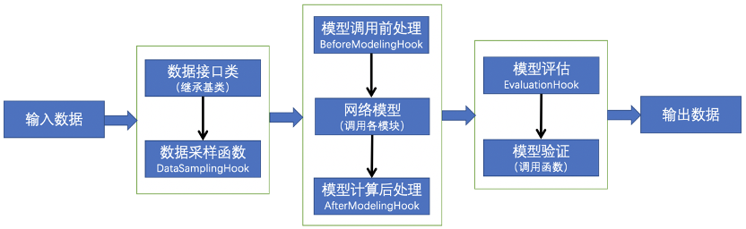
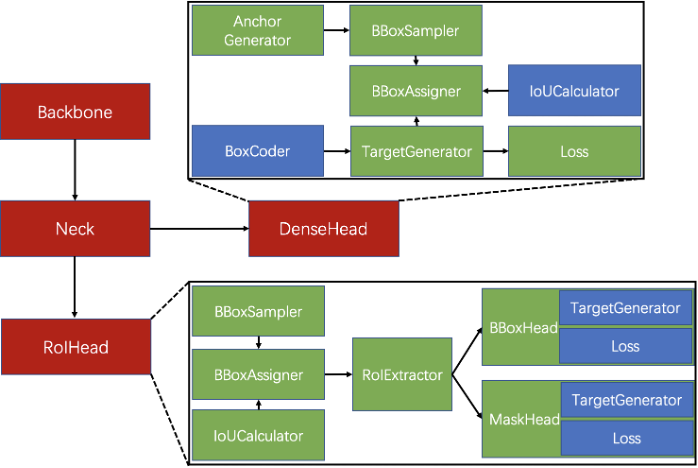

# ObjectiveMTL简介
## 开发目的
  ObjectiveMTL的主要开发目标是理解视觉内容，其主要动机如下：
  1. 业务需求驱动：数据模态多样、任务形式多样、数据不够纯净且部分业务存在比较大的主观性等，因此需要一个框架来实现快速多任务开发和模型更新与迭代。
  2. 行业趋势驱动：无监督、可解释性、自进化、有机组合、系统化、精细化等发展趋势需要有个业务开发平台去做支撑
	a) 无监督在视觉方面还仅限于场景分类任务，且要求的数据量大计算资源多。当前的主流研究目的是要适应“小数据”，这就需要一个支持迁移学习和增强学习框架来进行迭代开发；
	b) 可解释性要融入软件环境，让模型设计可调且透明，这需要一个框架去积累可解释性技术；
	c) 自进化以数据为驱动，生成AutoML模型，这本身也需要系统化工具的支持；
	d) 有机组合更需要一个框架去积累现有技术；
	e) 系统化对安全性健壮性的架构有着较强的需求；
	f) 精细化需要一个框架能够提供基础能力。
  3. 框架能力需求：
    a) 具备快速实现能力；
    b) 具备数据驱动的模型更新与迭代能力；
    c) 支持多任务学习；
    d) 支持特征层二次开发。

## 模型开发一般流程
  神经网络运算主要包含训练 training 和预测 predict （或 inference）两个阶段，训练的基本流程是：输入数据 -> 网络层前向传播 -> 计算损失 -> 网络层反向传播梯度 -> 更新参数，预测的基本流程是输入数据 -> 网络层前向传播 -> 输出结果。从运算的角度看，主要可以分为三种类型的计算：
  1. 数据在网络层之间的流动：前向传播和反向传播可以看做是张量 Tensor（多维数组）在网络层之间的流动（前向传播流动的是输入输出，反向传播流动的是梯度），每个网络层会进行一定的运算，然后将结果输入给下一层
  2. 计算损失：衔接前向和反向传播的中间过程，定义了模型的输出与真实值之间的差异，用来后续提供反向传播所需的信息
  3. 参数更新：使用计算得到的梯度对网络参数进行更新的一类计算
  基于这三种类型，我们可以对网络的基本组件做一个抽象：
  1. tensor 张量，这个是神经网络中数据的基本单位；
  2. layers 网络层，负责接收上一层的输入，进行该层的运算，将结果输出给下一层，由于 tensor 的流动有前向和反向两个方向，因此对于每种类型网络层我们都需要同时实现 forward 和 backward 两种运算；
  3. losses 损失，在给定模型预测值与真实值之后，该组件输出损失值以及关于最后一层的梯度（用于梯度回传）；
  4. optimizer优化器，根据现有权值大小和梯度，更新权值参数
  然后需要一些组件把上面四种基本组件整合到一起，形成一个计算管道：
  1. nn 组件负责管理 tensor 在 layers 之间的前向和反向传播，同时能提供获取参数、设置参数、获取梯度的接口；
  2. model 组件负责整合所有组件，形成整个 pipeline。即 nn 组件进行前向传播 -> losses 组件计算损失和梯度 -> nn 组件将梯度反向传播 -> optimizer 组件将梯度更新到参数；
  3. optimizer 优化器组件，负责使用梯度更新模型的参数。

## 总体方案设计与实现
  1. 框架设计
  当前大部分框架存在一些痛点问题：一是部分模块存在封装太深的问题，浏览和修改部分代码就需要在多个脚本之间来回跳跃，而且在继承拓展的时候无法和核心代码解耦。二是配置文件非常长，修改起来容易出错，而且改动的点不够清晰。
  为了缓解这些痛点问题，我们对代码结构进行了调整，简化了封装层次，减少对其他库的依赖，同时设计了新的配置系统，支持了多重继承机制。其实大多数研究员和开发者在写代码的过程中都会逐渐感受到，代码的工程质量会显著影响研发效率，所以框架不仅需要工程上稳定高效的实现，还需要保持灵活性来支持新方法。而我们设计框架也正是在朝着这个方向不断努力。
  主要设计规范如下：
    a) 系统构成模块化设计，提供从数据、模型结构、模型训练、模型评测及可视化等多方位的模块；
    b) 能够通过高层次的抽象描述配置特定类型的数据接口，并调用现有目标检测模型进行快速目标检测实现；
    c) 模块设计尽可能解耦，能够通过简单的模块调用代码进行组合设计；
    d) 模型配置项尽量扁平化设计，继承层级一般直接继承基类。不同任务设置不同的基类。继承同一基类的配置中数据项需要保持一致；
    f) 模型构造保持开放能够根据不同输入输出设计和注册构建函数，并通过配置项调用；
    g) 训练器和测试评估器均通过调用hooks类进行定制化开发，不同任务的hooks基类不一样。
  此外，相比于特定任务的框架而言，本框架还需进行一些功能上的扩展：
    a) 为了方便扩展，减少依赖，设计了一种新的配置文件组织方式；
    b) 框架支持多个head的配置；
    c) 模型框架设计了多级继承接口，能够分别正对各模块进行对应的forward函数扩展；
    d) 增加多任务学习loss；
    e) 增加多任务学习相关分析脚本；
    f) 增加多任务数据接口，能够通过配置实现常用的数据预处理，也可通过继承得到数据处理各阶段的处理接口，从而实现数据集的__getitem__函数扩展；
    g) 增加机智平台多机多卡训练脚本。
  在设计上，代码中广泛采用了模板模式，即父类定义一个模板结构，将具体内容延迟到子类去实现。这种方法特点：
    a) 一次性实现一个算法的不变的部分，并将可变的行为留给子类来实现。
    b) 各子类中公共的行为应被提取出来并集中到一个公共父类中以避免代码重复。即“重分解以一般化”，首先识别现有代码中的不同之处，并且将不同之处分离为新的操作。最后，用一个调用这些新的操作的模板方法来替换这些不同的代码。
    c) 控制子类扩展。模板方法只在特定点调用操作，这样就只允许在这些点进行扩展。
    d) 提高代码复用性，将相同部分的代码放在抽象的父类中
    e) 提高了拓展性，将不同的代码放入不同的子类中，通过对子类的扩展增加新的行为
    f) 通过一个父类调用其子类的操作，通过对子类的扩展增加新的行为，实现了反向控制 & 符合“开闭原则”
    g) 引入了抽象类，每一个不同的实现都需要一个子类来实现，导致类的个数增加，从而增加了系统实现的复杂度。

  2. 总体方案
  系统包括了数据接口、数据采样、模型调用前处理、模型、模型计算后处理、模型评估和模型验证几个部分。其计算流图如下：

  
  图1 系统计算流程图

  数据接口类和网络模型类是该系统的两大核心类。数据接口包括数据读取、格式转换和数据增强等。网络模型类所调用的模块包括各类骨干、颈部和头部网络，典型的目标检测模型结构如下图所示。在改变数据或模型结构的情况下，需通过创建新脚本编写相关类，并注册到系统中，通过配置文件进行调用。数据采样函数、模型前后处理和模型评估均通过Hooks进行调用，模型验证提供了数据校验和结果可视化等脚本工具。

  
  图2 目标检测模型结构图
